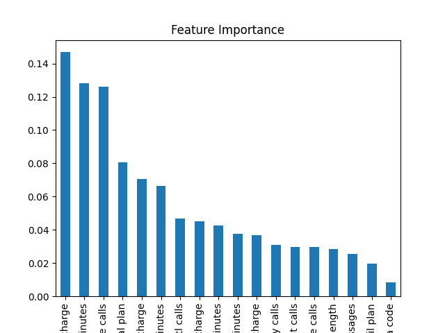

<h1 align="center"> Lux Academy Project for week 1</a></h1>

<h1> Telecom Customer Churn Prediction</h1>
<h2>Overview</h2>
This Python script is designed to predict customer churn for a telecom company using machine learning. It utilizes a dataset containing customer information, including various features such as account length, area code, international plan, voice mail plan, and more. The goal is to build a predictive model that can identify customers who are likely to leave (churn) and take proactive measures to retain them.
<h1>Project Context</h1>
The project revolves around a fictional telecom company, and the goal is to address the issue of customer churn. Customer churn refers to the rate at which customers stop using a company's services or products. In the telecom industry, high churn rates can be costly, as acquiring new customers is often more expensive than retaining existing ones.

<h1>Objective</h1>
The main objective of this project is to develop a machine learning model that can predict which customers are likely to churn in the future based on historical data and customer attributes. By identifying potential churners in advance, the telecom company can take proactive measures to retain these customers, such as offering them targeted promotions or improving service quality.

<h1>Problem Statement</h1> 
The specific problem addressed by this project can be summarized as follows:

<h1>Problem</h1>
Predict customer churn for a telecom company.

<h1>Background</h1>
The telecom company, represented here as a dataset, has historical data on its customers. This data includes information such as account length, usage patterns, international plan subscriptions, voice mail plan subscriptions, customer service calls, and whether a customer has churned or not.

<h1>Goal</h1>
Develop a machine learning model that can predict whether a customer is likely to churn based on the provided data.

<h1>Outcome:</h1>
The project aims to provide insights into customer churn and deliver a predictive model that can be used in practice to identify customers at risk of leaving. This allows the telecom company to take proactive measures to retain those customers and ultimately reduce churn rates, which can have a positive impact on business profitability.

## Prerequisites

Before running the code, ensure you have the following libraries installed in your Python environment:

- [pandas](https://pandas.pydata.org/)
- [numpy](https://numpy.org/)
- [matplotlib](https://matplotlib.org/)
- [scikit-learn](https://scikit-learn.org/stable/)

You can install these libraries using pip if they are not already installed:
<ol><li>pip install pandas numpy matplotlib scikit-learn</li></ol>
<h2>Data Preparation</h2>
The dataset has been stored in a folder named "Data" within the project directory.
Update the data_folder and data_file variables to specify the path to your data file.

<h2>Running the Code:</h2>

Open the Python script (churn_project.py) in your preferred code editor (e.g., Visual Studio Code).
Run the script to execute the following steps:
1. Ensure that your working directory folder is at Appfile folder
2. In the directoru, run _python churnproject.py_

<h1 align="center"> Code Explanation</a></h1>
<h1>Import necessary libraries</h1>
 
<kbd>
<ol>
<li>import pandas as pd</li>
<li>import numpy as np</li>
<li>import matplotlib.pyplot as plt</li>
<li>from sklearn.model_selection import train_test_split</li>
<li>from sklearn.preprocessing import LabelEncoder, StandardScaler</li>
<li>from sklearn.ensemble import RandomForestClassifier</li>
<li>from sklearn.metrics import accuracy_score, classification_report, confusion_matrix, roc_auc_score</li>
</ol>
</kbd>
 
This part imports the necessary Python libraries and modules for data manipulation, visualization, machine learning, and model evaluation.

<h1>Define the path to the data folder and file</h1>
 
<kbd>
<ol>
<li>data_folder = r'C:\Users\Njeri\Downloads\LuxProject1\Data'</li>
<li>data_file = 'telecom_churn.csv'</li>
<li>data_path = data_folder + '\\' + data_file</li>
</ol>
</kbd>
 
These lines define the path to the folder containing your dataset and specify the data file's name. It then creates the full data path by combining the folder and file names.

<h1># Load the dataset from your local directory</h1>
 
<kbd>
<ol>
<li>df = pd.read_csv(data_path)</li>
</ol>
</kbd>
 
This code uses Pandas to read the CSV dataset located at the specified data_path and stores it in a DataFrame named df.

<h1>Data Exploration and Preprocessing</h1>
Check the first few rows of the dataset
 
<kbd>
<ol>
<li>data_folder = print(df.head())</li>
</ol>
</kbd>
Check for missing values
<kbd>
<ol>
<li>print(df.isnull().sum())</li>
</ol>
</kbd>
 
These lines provide data exploration and preprocessing steps:
- df.head() prints the first few rows of the DataFrame to understand the structure of the dataset.
- df.isnull().sum() checks for missing values in the dataset and prints the count of missing values for each column.

<h1>Encode categorical variables using label encoding</h1>
 
<kbd>
<ol>
<li>label_encoder = LabelEncoder()</li>
<li>df['International plan'] = label_encoder.fit_transform(df['International plan'])</li>
<li>df['Voice mail plan'] = label_encoder.fit_transform(df['Voice mail plan'])</li>
</ol>
</kbd>
 
These lines encode categorical variables ('International plan' and 'Voice mail plan') using label encoding. This converts categorical values into numerical form, making them suitable for machine learning algorithms.

<h1>Drop the "State" column as it's non-numeric and may not be relevant for prediction</h1>
 
<kbd>
<ol>
<li>df.drop('State', axis=1, inplace=True)</li>
</ol>
</kbd>
 
This code drops the 'State' column from the DataFrame as it is non-numeric and may not be relevant for predicting customer churn.

<h1>Split the dataset into features (X) and the target variable (y)</h1>
 
<kbd>
<ol>
<li>X = df.drop('Churn', axis=1)</li>
<li>y = df['Churn']</li>
</ol>
</kbd>
 
These lines split the dataset into features (X), which are the independent variables used for prediction, and the target variable (y), which is 'Churn,' representing whether a customer has churned or not.

<h1>Split the data into training and testing sets</h1>
 
<kbd>
<ol>
<li>X_train, X_test, y_train, y_test = train_test_split(X, y, test_size=0.2, random_state=42)</li>
</ol>
</kbd>
 
This code splits the dataset into training and testing sets, with 80% of the data used for training and 20% for testing. The random_state parameter ensures reproducibility.

<h1>Feature Scaling</h1>
 
<kbd>
<ol>
<li>scaler = StandardScaler()</li>
<li>X_train = scaler.fit_transform(X_train)</li>
<li>X_test = scaler.transform(X_test)</li>
</ol>
</kbd>
 
These lines standardize the numerical features in the training and testing sets using the StandardScaler. Standardization ensures that all features have a mean of 0 and a standard deviation of 1, which is often necessary for many machine learning algorithms.

<h1>Model Training (Random Forest Classifier)</h1>
 
<kbd>
<ol>
<li>model = RandomForestClassifier(random_state=42)</li>
<li>model.fit(X_train, y_train)</li>
</ol>
</kbd>
 
This code initializes and trains a Random Forest Classifier using the training data.

<h1>Model Evaluation</h1>
 
<kbd>
<ol>
<li>y_pred = model.predict(X_test)</li>
<li>accuracy = accuracy_score(y_test, y_pred)</li>
<li>roc_auc = roc_auc_score(y_test, y_pred)</li>
<li>print("Accuracy:", accuracy)</li>
<li>print("ROC AUC:", roc_auc)</li>
<li>print("\nClassification Report:\n", classification_report(y_test, y_pred))</li>
<li>print("\nConfusion Matrix:\n", confusion_matrix(y_test, y_pred))</li>
</ol>
</kbd>
 
These lines evaluate the model's performance on the testing data and print metrics such as accuracy, ROC AUC score, a classification report, and a confusion matrix.

<h1>Feature Importance</h1>
 
<kbd>
<ol>
<li>feature_importance = pd.Series(model.feature_importances_, index=X.columns)</li>
<li>feature_importance.sort_values(ascending=False).plot(kind='bar')</li>
<li>plt.title("Feature Importance")</li>
<li>plt.show()</li>
</ol>
</kbd>
 
This code calculates and visualizes the feature importance scores generated by the Random Forest model. It creates a bar chart to display the importance of each feature in predicting customer churn.

<h1>Output</h1>

<h2>Contributors</h2>
- Winston Langat
<h2>License</h2>
This project is licensed under the lux Academy copy.